# Lab 01: Network Traffic Analysis & Protocol Investigation

## Objective
The goal of this lab was to move beyond theory and perform a hands-on analysis of how data moves across a network. By capturing live traffic in a controlled environment, I investigated the lifecycle of a connection from the initial hardware discovery to the application-layer data exchange.

## Technical Environment & Capture Initiation
- **OS:** Kali Linux VM
- **Tool:** Wireshark 4.6.4
- **Interface:** eth0
- **Target:** neverssl.com (Insecure) and google.com (Secure)

To begin the lab, I identified the primary network interface (`eth0`) and initiated a live capture. 

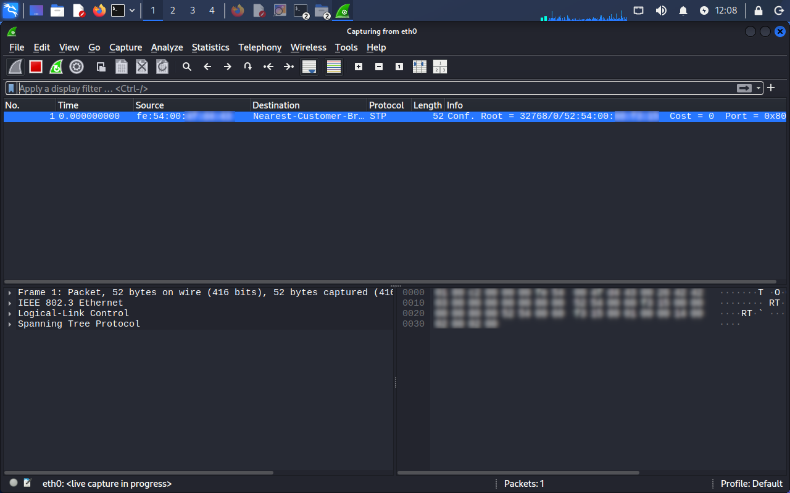
*Figure 1: Selecting the eth0 interface to begin live packet interception.*

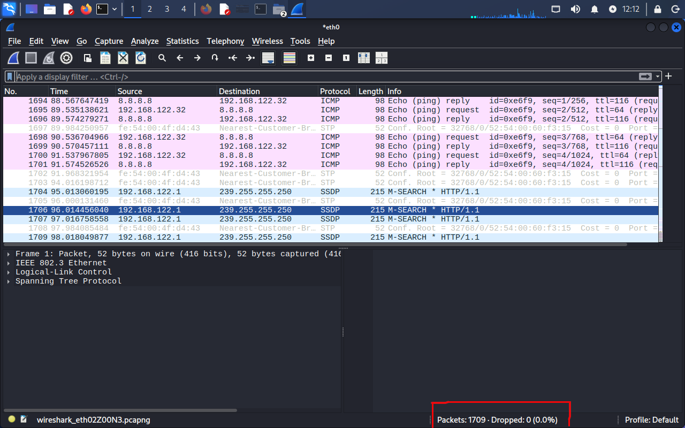  
*Figure 2: Final capture statistics showing 1,709 packets successfully processed with zero drops.*

---

## Protocol Analysis

### 1. Layer 2: ARP (Address Resolution Protocol)
I observed the ARP "Heartbeat" of the network. Every 30 seconds, the Gateway issued a request to verify my VM's MAC address. This confirmed that network identity is not static; it is constantly being verified to ensure data is delivered to the correct hardware.

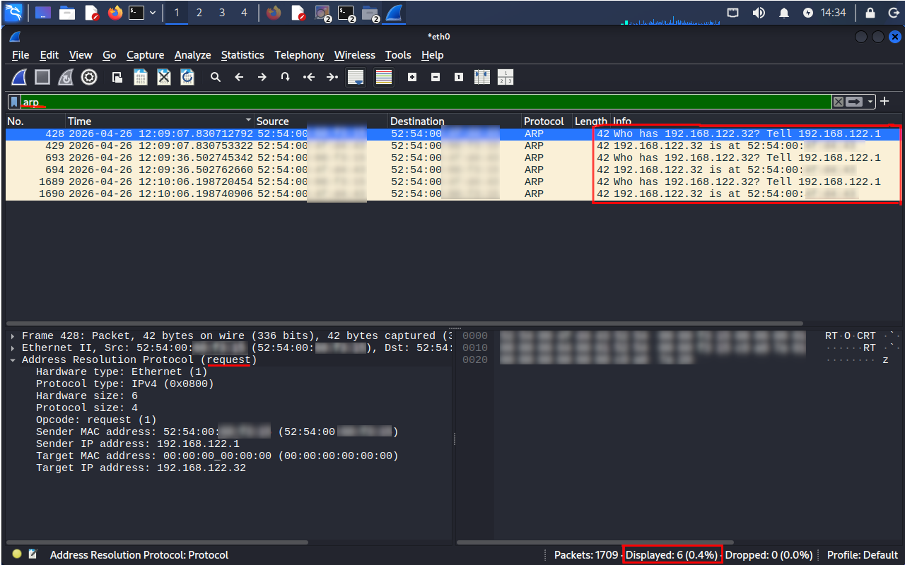
*Figure 3: Observation of the ARP Request/Reply cycles and the 30-second refresh heartbeat.*

### 2. Layer 3: ICMP (Internet Control Message Protocol)
I generated diagnostic traffic using the `ping` command in the terminal to verify reachability. I successfully captured 4 pairs of Echo Requests and Echo Replies in Wireshark.

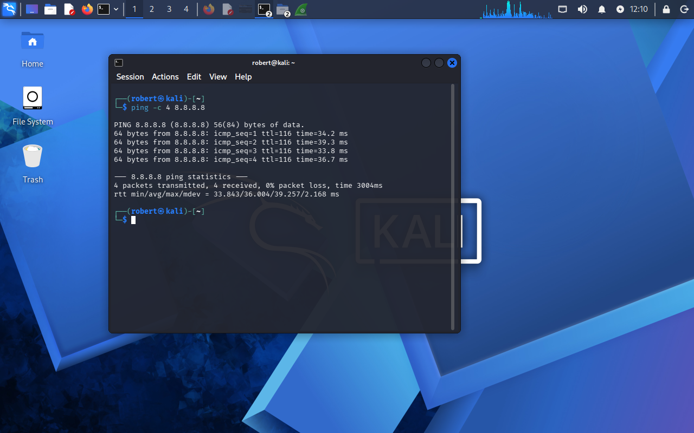
*Figure 4: Executing the ping command in the Kali terminal to generate ICMP traffic.*

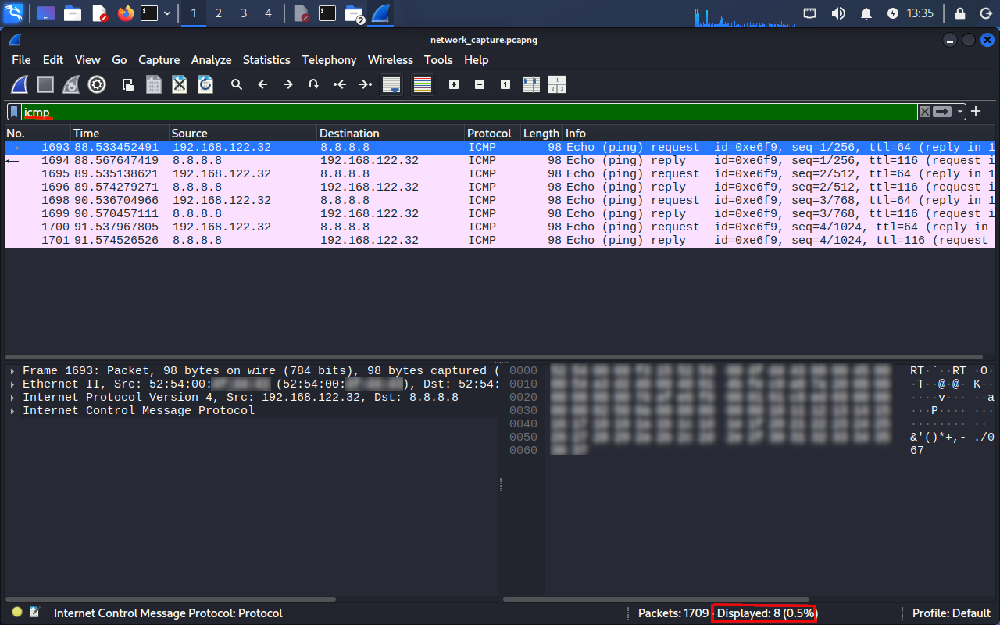
*Figure 5: Isolated ICMP traffic showing the 4-pair request and response sequence.*

### 3. Layer 7: DNS (Domain Name System)
To find the IP for `neverssl.com`, I isolated DNS traffic. Initially, the capture contained significant noise (82 packets), which required specific display filters to isolate the target resolution.

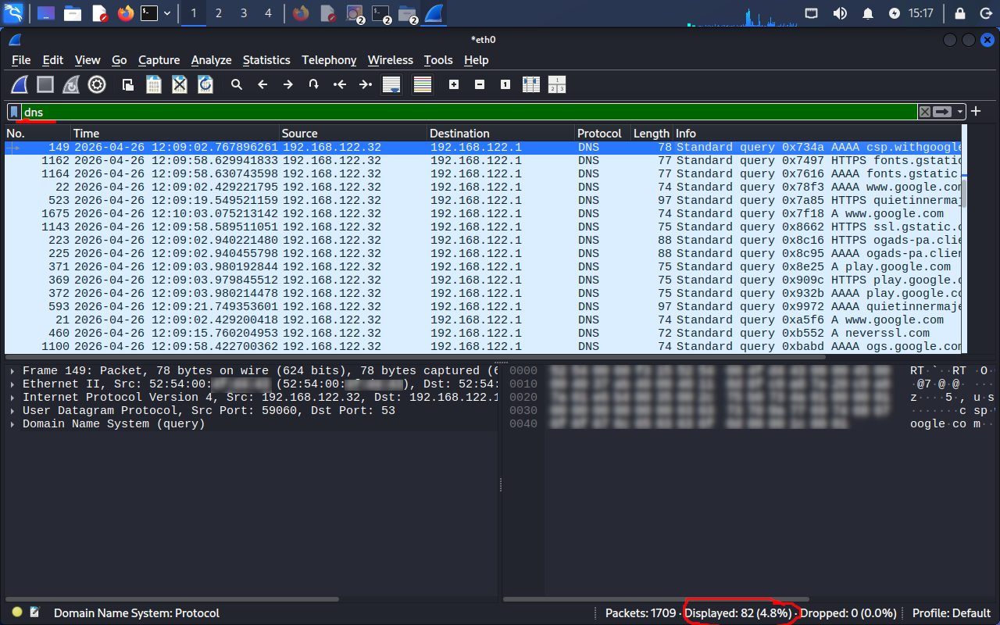
*Figure 6: Initial DNS filter showing the high volume of background network noise.*

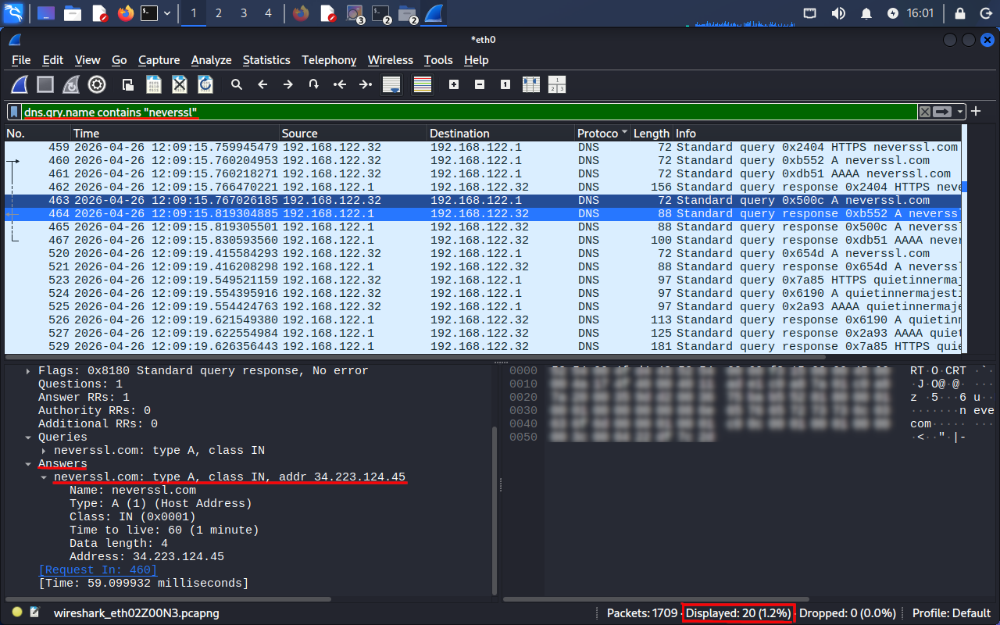
*Figure 7: Specific filter for 'neverssl' revealing the A-record and the destination IP address.*

---

## Connection Lifecycle & Security Analysis

### 4. Layer 4: TCP Handshake
Using the target IP found during the DNS phase, I isolated the conversation. I moved from a broad IP filter to a specific TCP Stream filter to analyze the 3-Way Handshake.

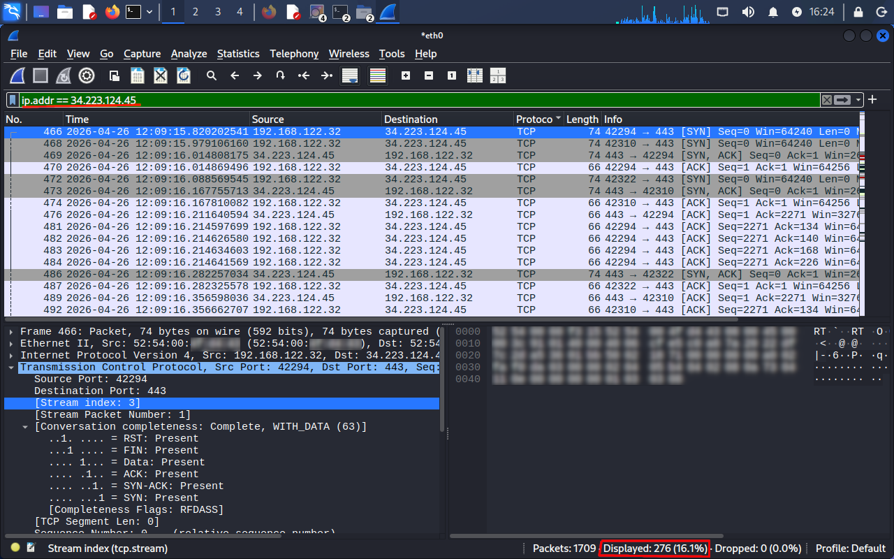
*Figure 8: Filtering by destination IP, yielding 276 packets related to the web session.*

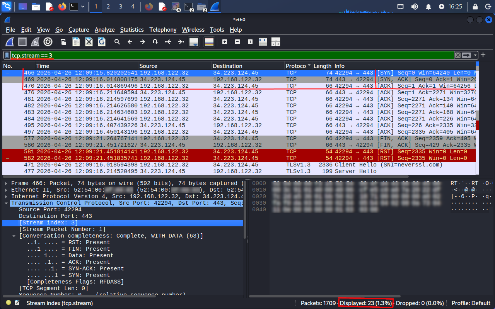
*Figure 9: Isolated TCP Stream 3, highlighting the successful SYN, SYN-ACK, ACK handshake.*

### 5. Security Comparison: HTTP vs. TLS
The primary finding of this lab was the contrast between encrypted and unencrypted traffic. I visited both a secure and an insecure site to compare the visibility of the data.

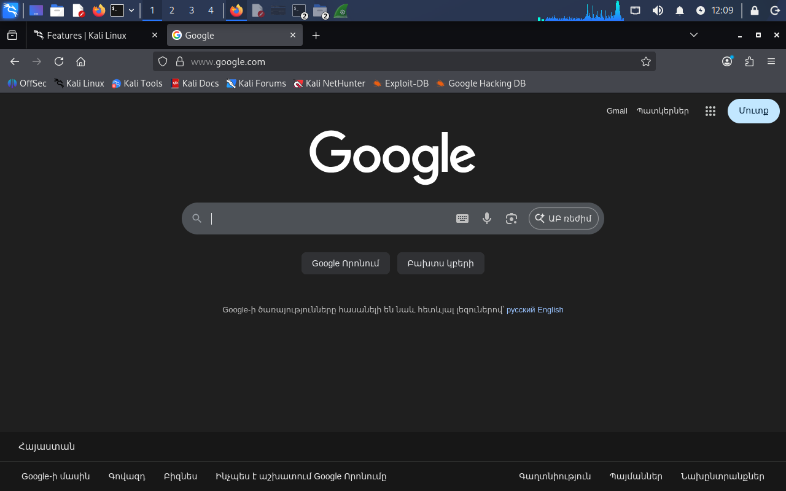
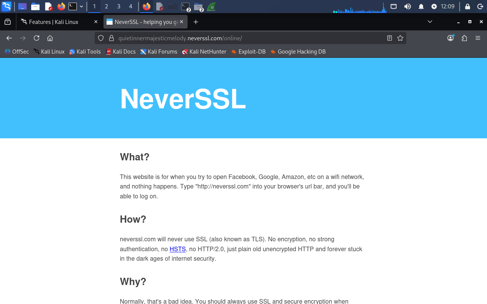
*Figure 10 & 11: Visiting secure (Google) and insecure (NeverSSL) targets to generate comparative data.*

#### **Insecure Traffic (HTTP)**
Filtering for HTTP requests allowed me to see the cleartext communication. Reconstructing the stream revealed the raw data being sent.

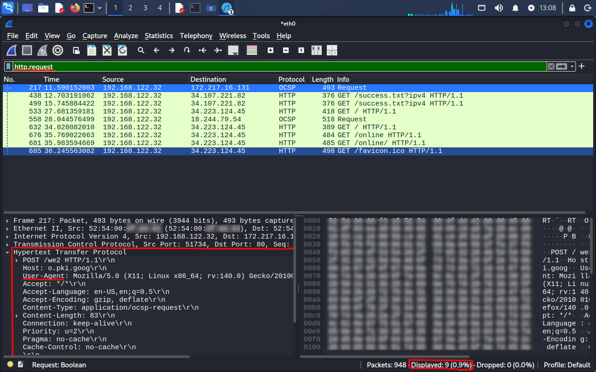
*Figure 12: Filtering for HTTP requests to isolate the unencrypted GET command.*

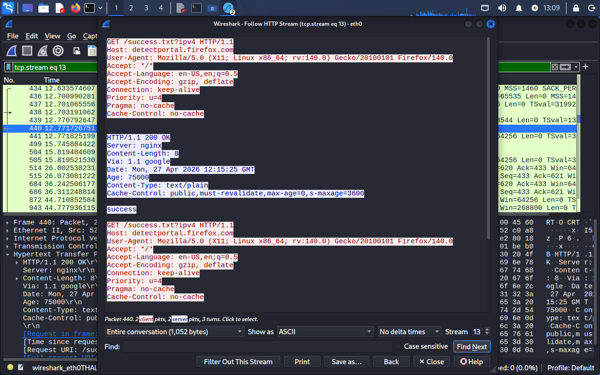
*Figure 13: Following the HTTP stream to reveal the User-Agent and raw HTML code in plain text.*

#### **Secure Traffic (TLS)**
In contrast, the TLS traffic showed the browser's attempt to secure the connection.

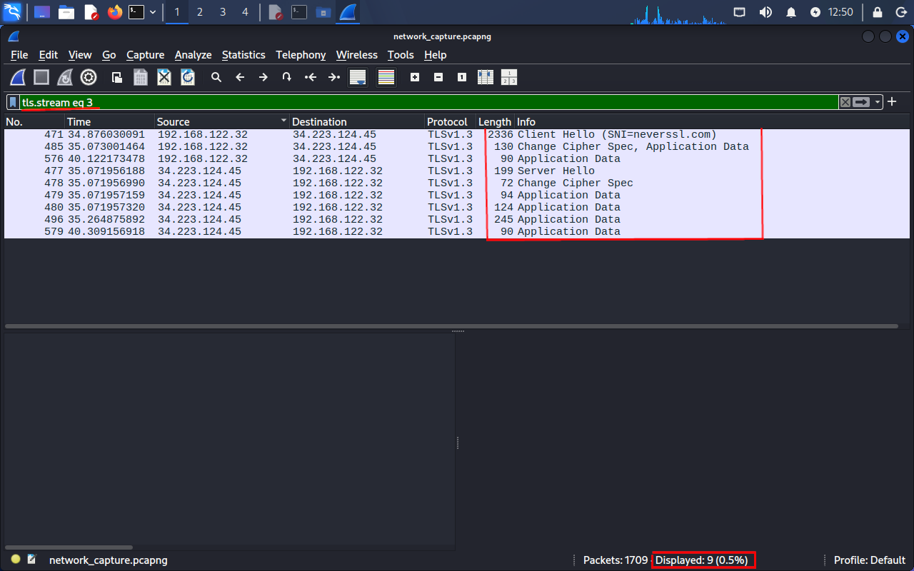
*Figure 14: Filtering for TLS traffic within the same conversation stream.*

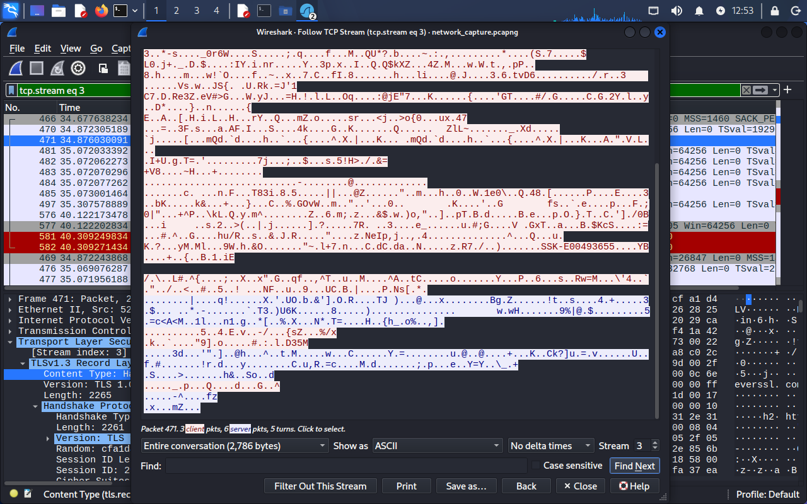
*Figure 15: Following the TLS stream reveals only encrypted ciphertext (gibberish), protecting the session.*

---

## Conclusion & Successes
This lab was a successful transition from theoretical study to practical execution. I overcame several environment-specific challenges, including:
- Identifying non-standard IP role assignments in a virtualized network.
- Managing browser caching by using Private/Incognito sessions to capture fresh traffic.
- Filtering through 1,700+ packets of noise to find specific protocol indicators.

By the end of this lab, I have a much deeper respect for the "invisible" work the network does every time we load a webpage. I am ready to apply these analysis skills to more complex defensive tasks.
